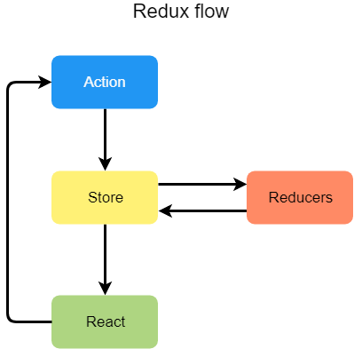

# Redux

## Concept

There is one main __store__ for the entire application, the _store_ holds state of all components. _State_ of the _store_ can only be modified by __reducers__, _store_ can have only __one root reducer__, the _root reducer_ is created by combining many _reducers_. The reducers use an __action__ to identify the _action_ that required to perform, an _action_ contains __type__ and __payload__. The __containers__ are the `.jsx` files that contains logic behind _components_, the _containers_ __dispatch__ an _action_ to perform an operation. When an _action_ is _dispatched_, all the _reducers are notified_. The _reducers_ use a `switch` operator on _action.payload_ to identify if the action is intended for it. The __react components__ include the __Containers__ in it.

## Why Redux

_Vanilla JS_ is suitable for ultra simple app that does not need any DOM manipulation. You can add _jQuery_ into the application if you need reusable code for DOM manipulation and other simplified HTTP requests etc, the disadvantage is maintaining the code is complicated over the time. _React_ is great for bigger projects because of _clear component model, synthetic events, and virtual dom_. React becomes complex when same data need to display in multiple places. _Redux_ makes data management very easy.

## Foundation of Redux

### 1. One Immutable store for entire application

Helps debugging, helps server rendering, do undo / redo etc.

### 2. Actions are always trigger changes

Action describes user's intent, example a click event for new customer.

### 3. State is changed by pure function (reducers)

## Core components

### Reducers

These are pure functions.

### Containers

These are react components that receive data via _props_.

## Redux flow

